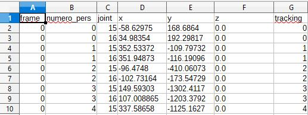
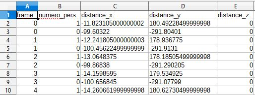
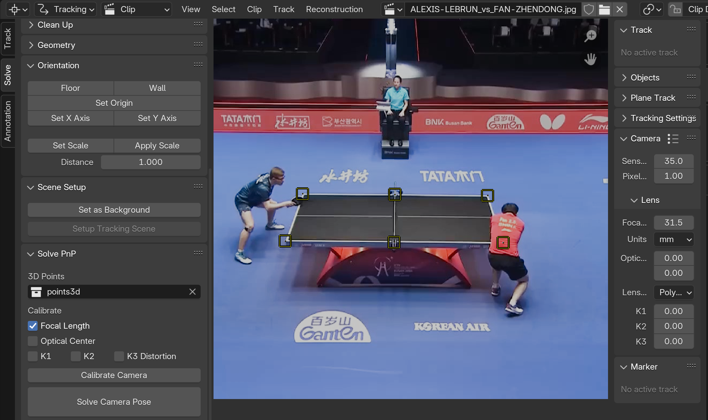
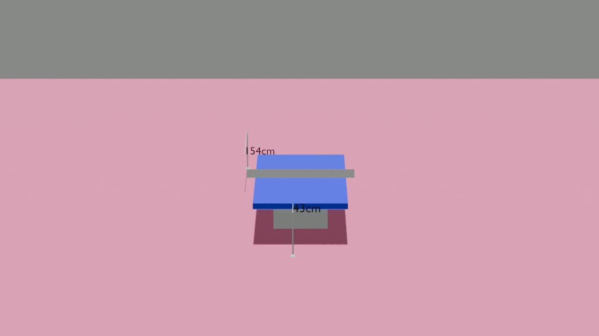
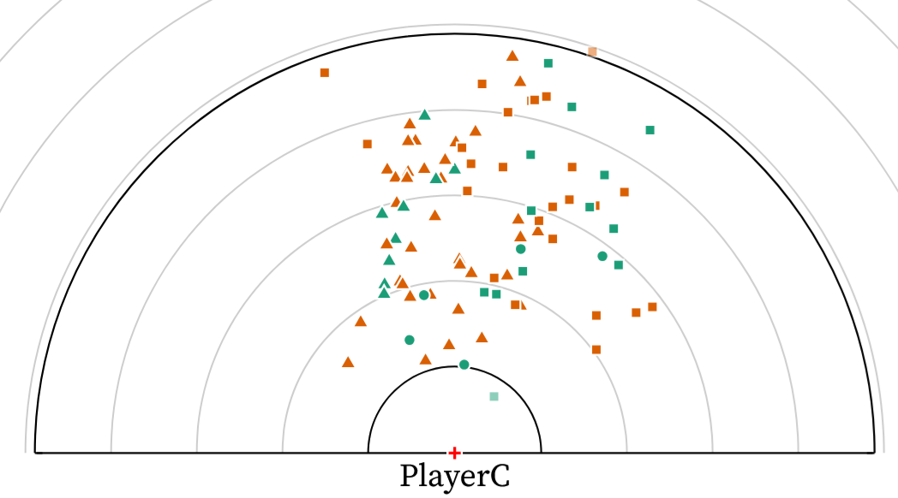
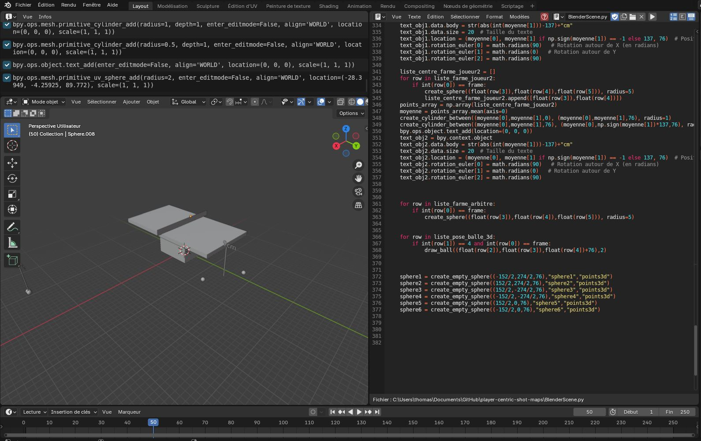
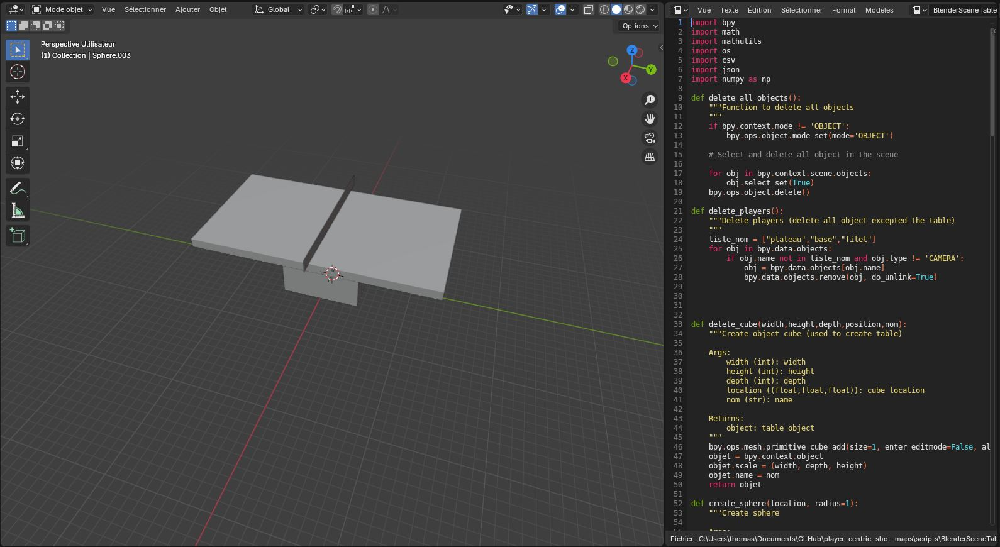

# Player Centric Shot Maps
This repo explains how to generate 3D scenes of table tennis points.
To create this scene, we used the API of Blender bpy. We provided a script to create scene with the table, players and ball position for each frame and the camera. We also provided a script to create a video of the point generated in the 3D scene.  

## How to cite

> Aymeric Erades & Romain Vuillemot (2025). « Player-Centric Shot Maps in Table Tennis ». Computer graphics Forum (Proc. Eurovis), p. 10.

```
@article{erades:hal-04997867,
  TITLE = {{Player-Centric Shot Maps in Table Tennis}},
  AUTHOR = {Erades, Aymeric and Vuillemot, Romain},
  URL = {https://hal.science/hal-04997867},
  JOURNAL = {{Computer graphics Forum (Proc. Eurovis)}},
  PAGES = {10},
  YEAR = {2025},
  MONTH = Jun,
  HAL_ID = {hal-04997867},
  HAL_VERSION = {v1},
}
```

## Steps
### 1. Install
- Python 3.11 required for bpy
- Download MMPose https://github.com/open-mmlab/mmpose
- ```bash
   pip install -r requirements.txt
   ```
- Download Blender https://www.blender.org/download/ (recommended)


### 2. Pose estimation
To estimate player positions we use the position of players' feet by using pose estimation with mmpose  
To generate pose estimation on a table tennis point video:  
- Use `create_mmpose_files()` from [mmpose_inference.py](https://github.com/centralelyon/player-centric-shot-maps/blob/main/scripts/mmpose_inference.py)
  - Params:
    - video_path  
(We need a video of a single camera with only one point)

This function creates a csv file with all players' pose estimation and with tracking provided  
the file looks like this:  


Generate position file:
- Use `create_csv_position_using_feet()` from [utils.py](https://github.com/centralelyon/player-centric-shot-maps/blob/main/scripts/utils.py)

This function creates a csv file with all players' positions and with tracking provided  
the file looks like this:  


### 3. Calibrate camera
If we don't know intrinsec camera parameters, we can estimate them with OpenCv functions such as `slovepnp()` or `calibrateCamera()` ([doc](https://docs.opencv.org/4.x/dc/dbb/tutorial_py_calibration.html). These functions can be used directly inside Blender with https://rtstudios.gumroad.com/l/camera_pnpoint 
To estimate these parameters, we can use 6 known points from the table whose correspondences in the 3d scene are known

We need to create a json with these parameters (example: https://github.com/centralelyon/player-centric-shot-maps/blob/main/example/PRITHIKA-PAVADE_vs_SIBEL-ALTINKAYA_camera.json)  
To create this json file we provide the function `create_json_camera()` from [utils.py](https://github.com/centralelyon/player-centric-shot-maps/blob/main/scripts/utils.py)
This function needs as parameters some informations from `calibrateCamera()` function:
- Focal length
- Optical center
- Distorsion (K1,K2,K3)
- Location
- Rotation


## 4. Create video of player's position
To create the video of players' positions we need to annotate more information such as rebound positions, hit positions and compute 3D ball trajectories.  
We provided an example with all necessary files to create the video. All of this is in the folder example.  
To generate video `python render_image.py`  
  
This function uses:
- Players' position
- Ball position
- Camera parameters
- Annotations

## 5. Create csv with new referential
To create the csv with coordinates in the new referential we need to use `create_csv_new_ref()` from [utils.py](https://github.com/centralelyon/player-centric-shot-maps/blob/main/scripts/utils.py)
example:  
`create_csv_new_ref("example/set_1_point_8_annotation_enrichi.csv","example/set_1_point_8_position_ordonne.csv")`

example of new referential points plotted:



## 6. Miscellaneous
[BlenderScene.py](https://github.com/centralelyon/player-centric-shot-maps/blob/main/scripts/BlenderScene.py) is to create 3D scene in Blender.  
Load the file in Blender  
You need to change path:
- chemin_pose_3d
- chemin_pose_balle_3d  
Execute the code  



If you want to create a 3D scene in Blender with only the table, with provide a code [BlenderSceneTable.py](https://github.com/centralelyon/player-centric-shot-maps/blob/main/scripts/BlenderSceneTable.py)  


